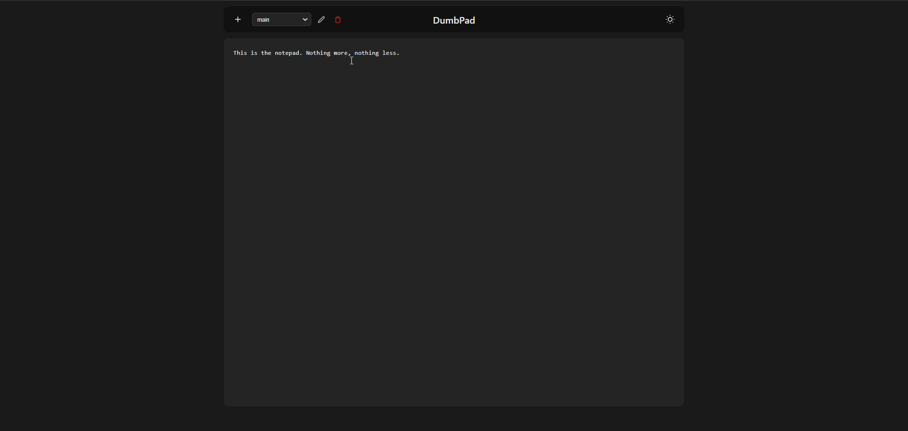

<!--
NB: Deze README is automatisch gegenereerd door <https://github.com/YunoHost/apps/tree/master/tools/readme_generator>
Hij mag NIET handmatig aangepast worden.
-->

# DumbPad voor Yunohost

[](https://ci-apps.yunohost.org/ci/apps/dumbpad/)


[](https://install-app.yunohost.org/?app=dumbpad)

*[Deze README in een andere taal lezen.](./ALL_README.md)*

> *Met dit pakket kun je DumbPad snel en eenvoudig op een YunoHost-server installeren.*  
> *Als je nog geen YunoHost hebt, lees dan [de installatiehandleiding](https://yunohost.org/install), om te zien hoe je 'm installeert.*

## Overzicht

A stupid simple, no auth (unless you want it!), modern notepad application with auto-save functionality and dark mode support.

### Features

- Simple, clean interface
- Auto-saving
- Dark mode support
- Responsive design
- Optional PIN protection (4-10 digits)
- File-based storage
- Data persistence across updates


**Geleverde versie:** 2025.03.26~ynh1

## Schermafdrukken



## Documentatie en bronnen

- Officiele website van de app: <https://www.dumbware.io/>
- Upstream app codedepot: <https://github.com/DumbWareio/DumbPad>
- YunoHost-store: <https://apps.yunohost.org/app/dumbpad>
- Meld een bug: <https://github.com/YunoHost-Apps/dumbpad_ynh/issues>

## Ontwikkelaarsinformatie

Stuur je pull request alsjeblieft naar de [`testing`-branch](https://github.com/YunoHost-Apps/dumbpad_ynh/tree/testing).

Om de `testing`-branch uit te proberen, ga als volgt te werk:

```bash
sudo yunohost app install https://github.com/YunoHost-Apps/dumbpad_ynh/tree/testing --debug
of
sudo yunohost app upgrade dumbpad -u https://github.com/YunoHost-Apps/dumbpad_ynh/tree/testing --debug
```

**Verdere informatie over app-packaging:** <https://yunohost.org/packaging_apps>
